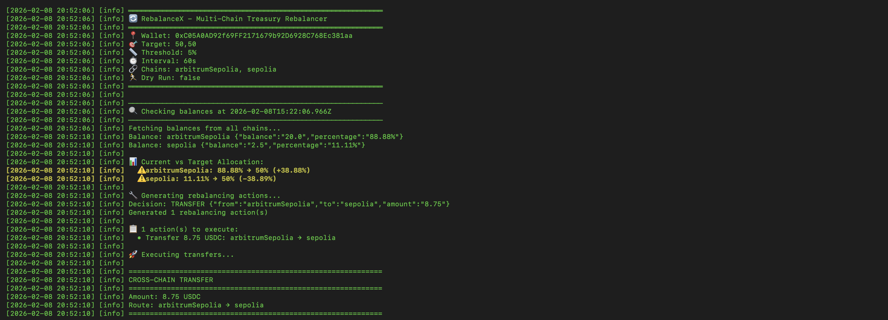
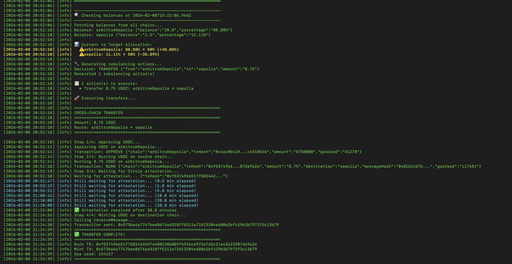
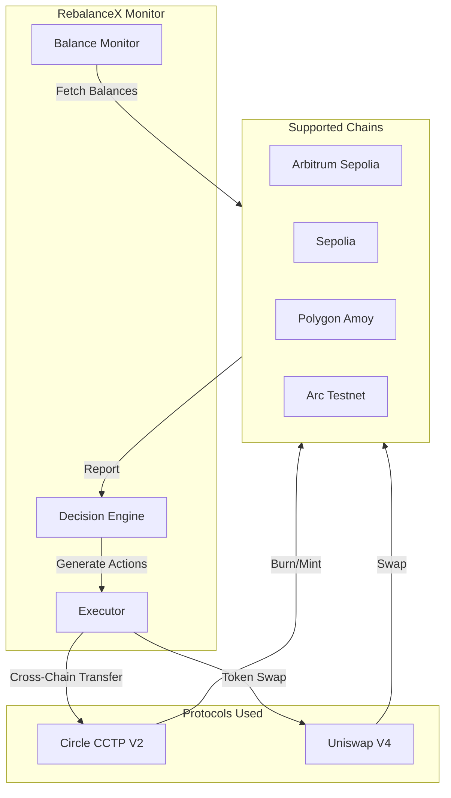
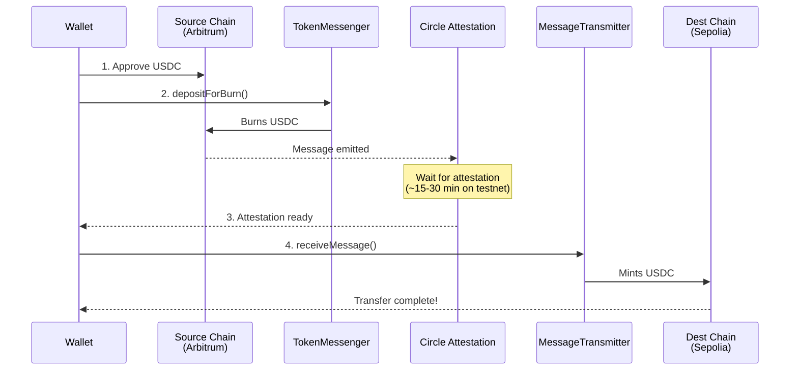

# RebalanceX

**Autonomous Multi-Chain Treasury Rebalancer**

RebalanceX automatically monitors and rebalances USDC holdings across multiple EVM chains using Circle's CCTP V2 protocol, with optional DEX swaps powered by Uniswap V4.

[](https://developers.circle.com/cctp)
[](https://docs.uniswap.org/)
[](https://arc.network)

---

## Problem

DAOs and protocols hold USDC across multiple chains. Keeping allocations balanced is:
- Manual and time-consuming
- Expensive (bridge fees, missed opportunities)
- Error-prone (wrong addresses, stuck transactions)

## Solution

RebalanceX runs continuously, automatically executing cross-chain transfers when allocations drift beyond your threshold.

---

## Screenshots





---

## Architecture



---

## CCTP Transfer Flow



---

## Technology Stack

### Circle CCTP V2
- **TokenMessenger**: Burns USDC on source chain via `depositForBurn()`
- **MessageTransmitter**: Mints USDC on destination chain via `receiveMessage()`
- **Attestation API**: Cryptographic proof for cross-chain message verification

### Uniswap V4 (Planned/Hooks)
- **Universal Router**: Execute swaps before/after transfers
- **Custom Hooks**: Pre/post transfer logic for optimal execution
- **Multi-hop Routing**: Best price discovery across pools

### Arc Network
- **Native USDC Gas**: Pay gas fees in USDC (no ETH needed)
- **Fast Finality**: Quick transaction confirmations
- **EVM Compatible**: Standard contract deployment

---

## Quick Start

```bash
# Clone
git clone https://github.com/R-Abinav/RebalanceX.git
cd RebalanceX

# Install
npm install

# Configure
cp .env.example .env
# Edit .env with your private key and RPC URLs

# Build
npm run build

# Run (dry run first!)
npm start -- --dry-run --once

# Run for real
npm start -- --once
```

---

## Configuration

| Flag | Description | Default |
|------|-------------|---------|
| `--chains` | Comma-separated chain list | `sepolia,arbitrumSepolia` |
| `--target` | Target allocation percentages | `50,50` |
| `--threshold` | Rebalance trigger threshold | `5%` |
| `--interval` | Check interval (seconds) | `60` |
| `--dry-run` | Simulate without executing | `false` |
| `--once` | Run once and exit | `false` |

### Example Commands

```bash
# 50-50 split between Arbitrum and Sepolia
npm start -- --chains arbitrumSepolia,sepolia --target 50,50 --threshold 5

# 60-40 split with 10% threshold
npm start -- --chains sepolia,polygonAmoy --target 60,40 --threshold 10

# Continuous monitoring
npm start -- --interval 120
```

---

## Project Structure

```
RebalanceX/
├── src/
│   ├── index.ts          # CLI entry point
│   ├── monitor.ts        # Balance monitoring & rebalancing logic
│   ├── config.ts         # Chain configs, contract addresses, ABIs
│   ├── logger.ts         # Winston logger with colors
│   └── executors/
│       └── arc.ts        # CCTP V2 transfer executor
├── .env.example          # Environment template
├── package.json
└── README.md
```

---

## Supported Chains

| Chain | Domain ID | Status |
|-------|-----------|--------|
| Ethereum Sepolia | 0 | Active |
| Arbitrum Sepolia | 3 | Active |
| Polygon Amoy | 7 | Active |
| Arc Testnet | 10 | Planned |

---

## Hackathon Bounties

### Circle CCTP V2
- Cross-chain USDC transfers using CCTP V2
- TokenMessenger `depositForBurn()` with V2 parameters
- MessageTransmitter `receiveMessage()` for minting
- Attestation API integration (V2 format)

### Uniswap V4
- Universal Router integration for pre/post swaps
- Custom hooks for optimized execution
- Multi-chain liquidity aggregation

### Arc Network
- Native USDC gas token support
- Arc testnet deployment
- Fast finality optimization

---

## Demo

Watch the demo video showing a complete cross-chain transfer:
1. **Balance Check**: Detects 88% / 12% imbalance
2. **Decision**: Generate transfer action (8.75 USDC)
3. **CCTP Flow**: Approve -> Burn -> Attest -> Mint
4. **Result**: Balanced 50% / 50% allocation

---

## Security

- Private keys stored in `.env` (never committed)
- All transactions require explicit approval
- Dry-run mode for safe testing
- Gas estimation before execution

---

## License

MIT

---

## Acknowledgments

- [Circle](https://circle.com) - CCTP V2 Protocol
- [Uniswap](https://uniswap.org) - V4 DEX Infrastructure
- [Arc Network](https://arc.network) - Native USDC Chain

---

**Built by Abinav for HackMoney 2026**
